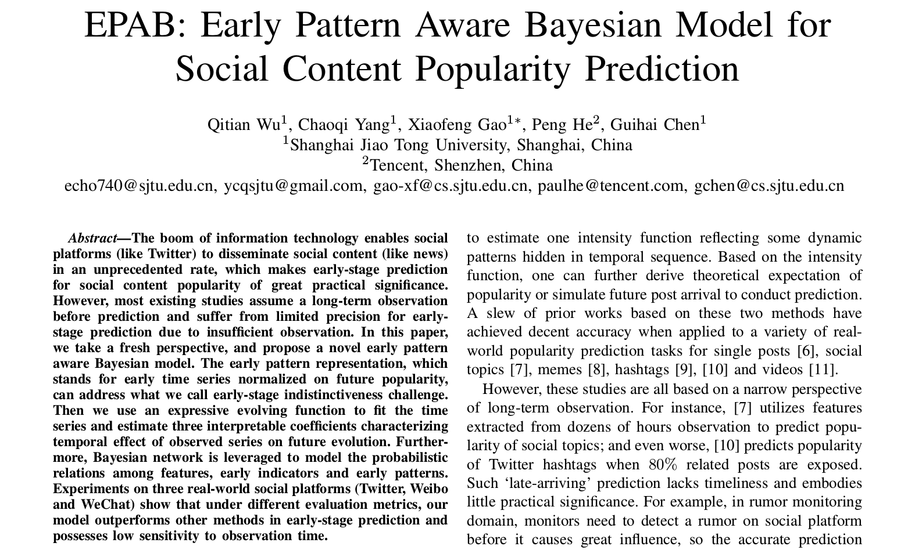

# ICDM2018-EPAB
<strong>Conference: IEEE International Conference on Data Mining (Singapore) - ICDM2018 (accepted)</strong> 
<strong>Author</strong>: Qitian Wu, <a href="http://chaoqiyang.com">Chaoqi Yang</a>, Xiaofeng Gao, Peng He, Guihai Chen 
<strong>Title</strong>: EPAB: Early Pattern Aware Bayesian Model for Social Content Popularity Prediction  
  
## Brief Model
#### (1). The early pattern of each cascade is represent as a vector: 
 
#### cluster the early pattern
 
#### (2). We introduce three hidden variable to capture describe the state of each cascade. 
- Influence(h1): how many people have been influenced by this tweet.
- Attractiveness(h2): how many people tend to click and repost this tweet.
- Potentiality(h3): how many people will be exposed to this tweet.
 
- optimize the loss function between ground truth and predicted value
- get alpha, beta, gamma for each pattern
- and get h1, h2, h3 for each cascade.
 
#### (3). two-layer Bayesian network to model observable feature X, hidden variable H, and final state Y.
- refer to the paper for detailed deduction
- bayesian rule

#### (4). Solve the loss function, get the model.
- to solve this loss function, we can compute the loss of theta1, theta3, and theta2 seperately 
- use stochastic gradient descent and hill-climbing

---
<strong>Edited on Sep. 10th, 2018</strong> 
Contact <a href="http://chaoqiyang.com">Chaoqi Yang</a> at ycqsjtu@gmail.com, Shanghai Jiao Tong University for more information!
